### 7 in 7: Day 1 - Number Flow ###

#### Guiding Questions ####
* How can the mental model of arithmetic be made clearer and more functional?
* How can number sense be cultivated at an early level?

#### Need ####
A major challenge for the transition from arithmetic to algebra is that students tend to rely on rote without having a good grasp of numbers, operations and what they represent; this is essentially a process-dependent activity. When the unknown x comes into the picture, they are not able to see the patterns behind the operations, and apply these patterns to all numbers in general. This is called abstraction, and is necessary for building upon prior mathematical knowledge to higher abstractions.

When students are taught functions, they are usually presented with the function machine.  
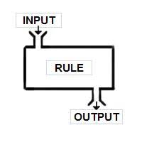 
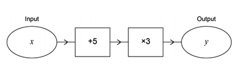   
They are taught that rules happen within this black box, and as machines, they have to operate on the numbers. A more useful method is to break up the operations in a systems fashion, where each part performs a smaller function, a sequence of operations. 

#### Inspiration ####
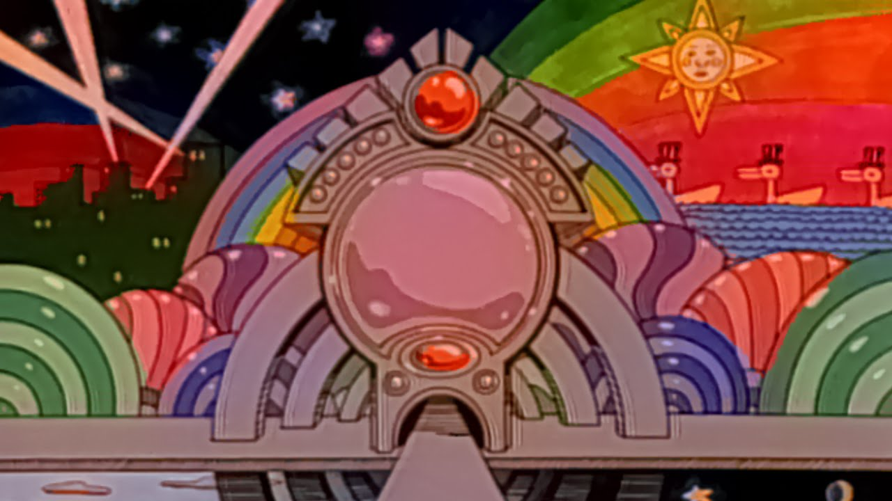   
I'm fascinated by Rube Goldberg machines, marble races, and much earlier on the Sesame Street pinball number count sequence. I tend towards environments where students can play, explore and have fun, without any red crosses. What is important though is the idea of feedback: that what they do would give them a response, such that they can try something else.

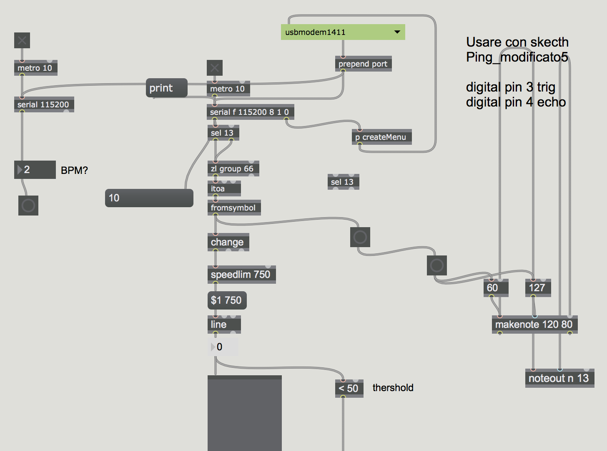   
I'm also inspired by flow/node-based programming in software targeted at artists and designers, such as Max MSP. The flow of the program can be traced, as water flows, and at each node, something is being done to the signal.

#### The Idea ####

This is an exploration on the idea of flow/nodes on basic arithmetic in a way that is pedagogically sound.

Yellow balls are passed through tubes. Green flaps are counters, and can be placed at any part of the tube network.  
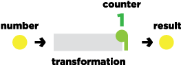   

#### Addition ####
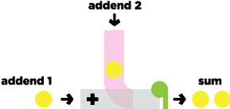   
The addition machine adds balls through a tube, using gravity to send it down, where it combines with the main tube.
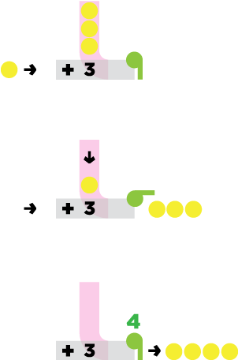   

#### Subtraction ####
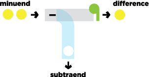   
The subtraction machine has holes for balls to fall through, allowing the remainder to pass untouched.
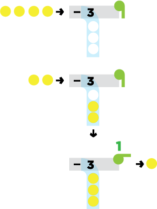   

#### Multiplication ####
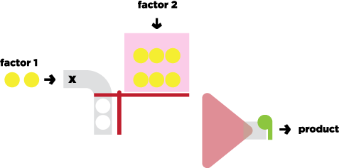   
The multiplication machine uses a level to move the platform down, bringing rows of balls down on the right hand side. The balls are then sucked through the funnel.  
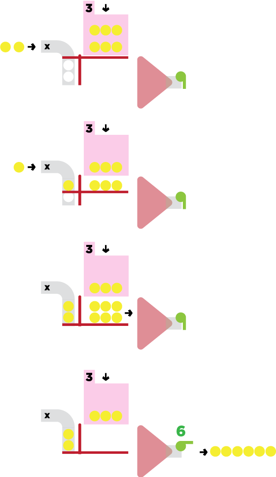   

#### Division ####
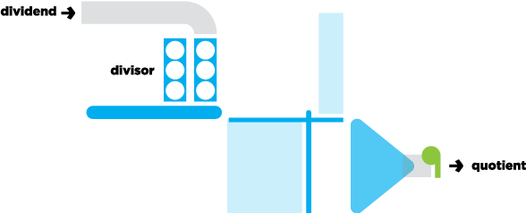   
The division machine uses containers with holes, filling each in turn, dropping via a conveyor belt. These containers activate a level, and the funnel counts the number of groups.  
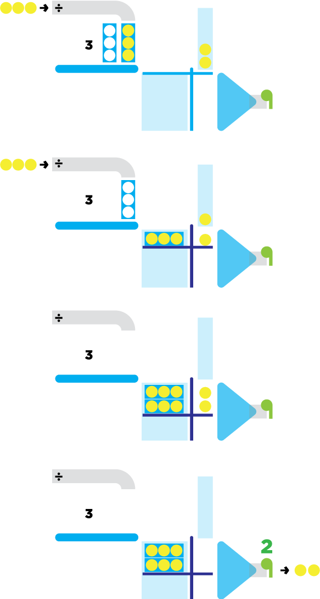   

#### Example ####
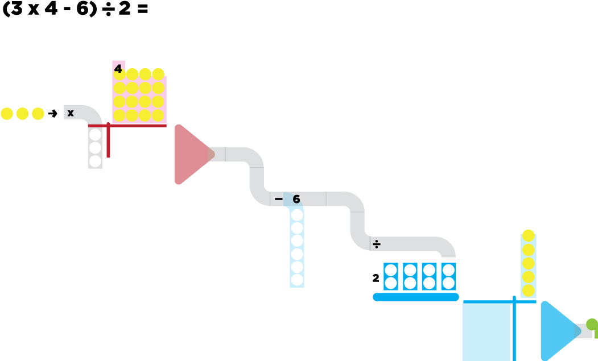   

#### Process ####
I worked with some prior pedagogical knowledge. I wanted the multiplication model to show the geometric possibilities (creating rectangular area models) by creating groups, and the division model to reflect grouping and counting groups.

#### Reflections ####
While it was a thoroughly interesting exercise in thinking of creating mental models, it was difficult to reflect multiplication and division as a machine process.

I think whilst the graphic format allows for communication of how it works, I am curious as to how students will react or give feedback by looking at the graphics alone. Ideally, I would have wanted a prototype with interactivity, such as pressing buttons. I guess a paper prototype would be more descriptive since I could move the individual pieces to see how they all move.

