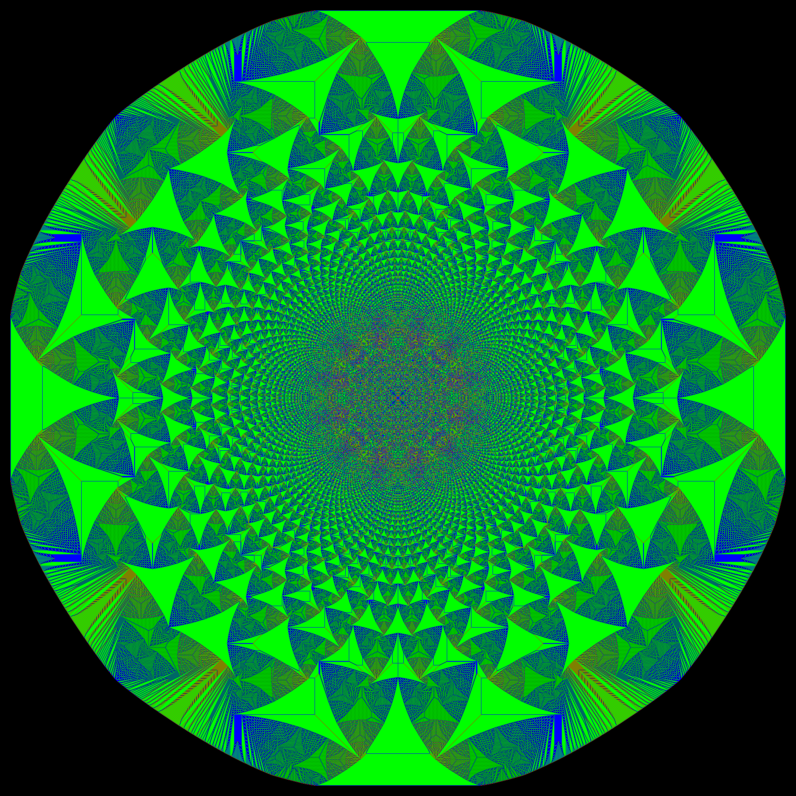
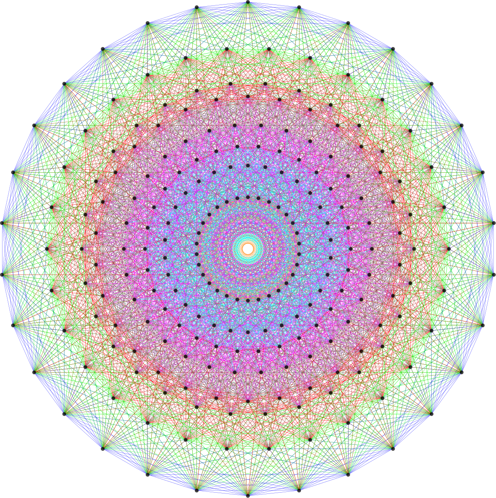
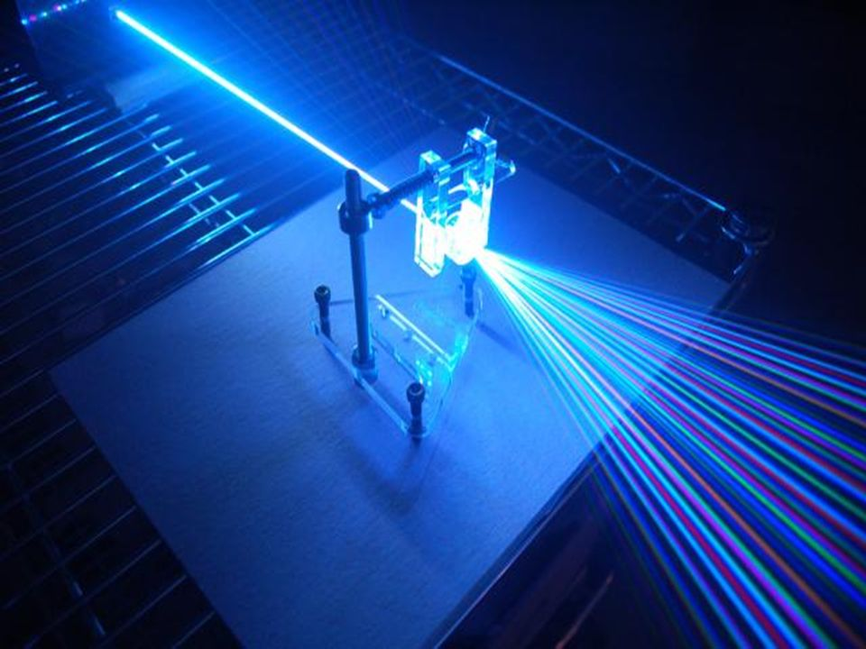

### 7 in 7: Day 2 - Projective Geometry ###

#### Questions to Answer ####
I'm curious as to how using light can recreate interesting and complex geometries, and what sort of user interactions are possible to create these patterns.

#### Inspiration ####
  x   
I have been fascinated by emergent behavior resulting in beautiful patterns for some time now. I started back as an undergrad looking at Islamic geometric art and recall attempting to trace the  methods of the old masters. Fractral geometry has been such a naturally recurring phenomenon that it has a spiritual status and can be seen on many spirituality websites. 

    
 
Last night, I revisited this topic of interesting geometries, starting from more fractals (recursive geometry), to sandpile visualizations (cellular automata) to Petrie polygon projections (projection geometry).

#### The Idea ####
I'm trying not to use simulated methods involving code. Rather I am curious about how to use strong sources of light to get rays to get light patterns.

#### Process ####
I first tried out using copper tape on my phone's LED light source, since the blockage of lights would be more complete. I tried poking a hole through but the light is unfocused. I tried cutting a slit once using a pair of scissors, and it created a sort of diffraction pattern, which wasn't what I wanted, though interesting to try this for myself.

I researched on how to focus light, and found out that no amount of optics can create a fine ray, and the only way to do that is using lasers, essentially using electromagnetic waves of the same frequency.

Since I wanted to experiment with rays dispersing from a point, I needed some way to split it. I found that diffraction gratings do this, and that I can test this out using CDs.

  

The order for laser diodes are being delivered and I will update once I get them.

#### Reflections ####

