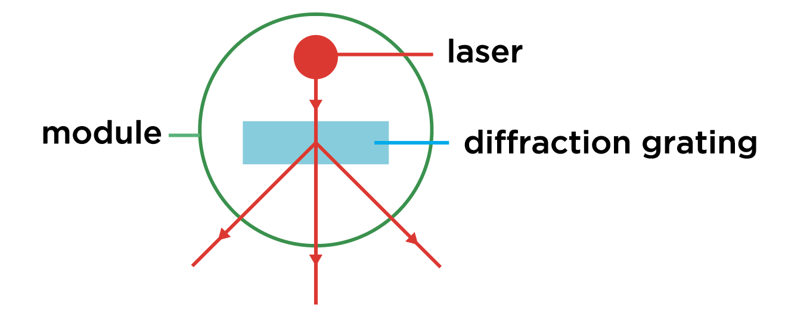
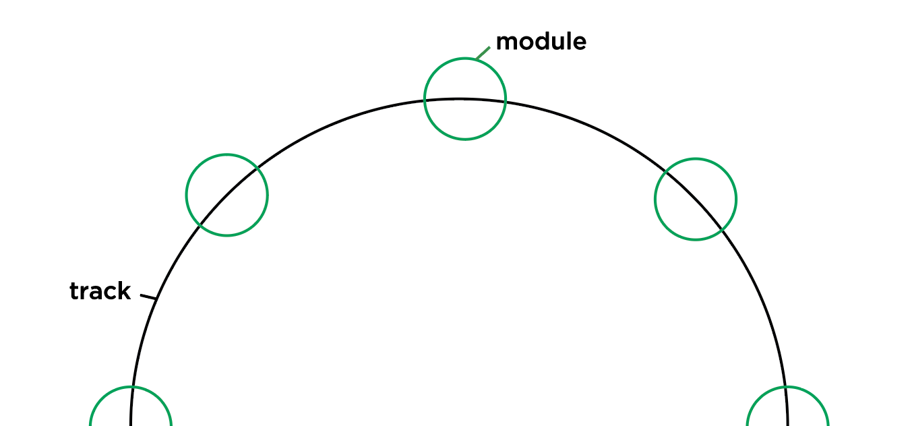

### 7 in 7: Day 2 - Projective Geometry ###

#### Questions to Answer ####
I'm curious as to how using light can recreate interesting and complex geometries, and what sort of user interactions are possible to create these patterns.

#### Inspiration ####
     
I have been fascinated by emergent behavior resulting in beautiful patterns for some time now. I started back as an undergrad looking at Islamic geometric art and recall attempting to trace the  methods of the old masters. Fractral geometry has been such a naturally recurring phenomenon that it has a spiritual status and can be seen on many spirituality websites. 

   
 
Last night, I revisited this topic of interesting geometries, starting from more fractals (recursive geometry), to sandpile visualizations (cellular automata) to Petrie polygon projections (projection geometry).

#### The Idea ####
I'm trying not to use simulated methods involving code for prototyping, ruling out sandpile simulations and fractals. Rather I am curious about how to use strong sources of light to get rays to get light patterns. The idea was to arrange modules consisting of lasers with diffraction gratings around a circular track, such that the rays would intersect inside the circle to create patterns.  
   

#### Process ####
I first tried out using copper tape on my phone's LED light source, since the blockage of lights would be more complete. I tried poking a hole through but the light is unfocused. I tried cutting a slit once using a pair of scissors, and it created a sort of diffraction pattern, which wasn't what I wanted, though interesting to try this for myself.

I researched on how to focus light, and found out that no amount of optics on white light can create a fine ray, and the only way to do that is using lasers, essentially using electromagnetic waves of the same frequency.

  

Since I wanted to experiment with rays dispersing from a point, I needed some way to split it. I found that diffraction gratings do this, and that I can test this out using the [plastic from CDs](https://www.nnin.org/sites/default/files/files/Karen_Rama_USING_CDs_AND_DVDs_AS_DIFFRACTION_GRATINGS_0.pdf). This did not work out the way I expected. Either the CD was not cleaned of sticker coating enough, or the diffracted rays were too faint to be seen. I also tried seeing if crossing beams would cause the intersection to glow brighter.

<iframe src="https://player.vimeo.com/video/369569682" height="564"  frameborder="0" allow="autoplay; fullscreen" allowfullscreen></iframe> 
<iframe src="https://player.vimeo.com/video/369569624" height="564" frameborder="0" allow="autoplay; fullscreen" allowfullscreen></iframe>
 

I also experimented in making the laser rays more visible, in order to approximate the effect that I wanted. I tried spraying a water mist, and a finer spray from an aerosol. As the mist settled quickly, the ray was visible for only a short time.

<iframe src="https://player.vimeo.com/video/369569661" height="564" frameborder="0" allow="autoplay; fullscreen" allowfullscreen></iframe>   
<iframe src="https://player.vimeo.com/video/369569607"  height="564" frameborder="0" allow="autoplay; fullscreen" allowfullscreen></iframe>  

#### Reflections ####
There is something inherently fascinating in lasers, and more so when the paths are more defined. With the tools I had, I was not able to get a pattern, but the experiments gave me a better idea of working with lasers as a medium and how to make them more visible. I could build upon this and get (expensive) diffraction gratings which would give clearer paths, which would also be more coherent physics-wise. I could also get more laser diodes since they are inexpensive, and get enough to cause interference patterns. I would also need a smoke machine or dry ice or anything that generates finer, lighter particles to reflect the light.

