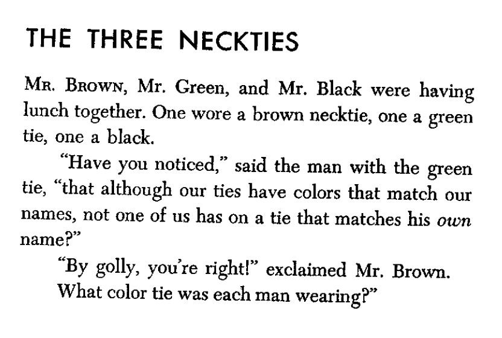
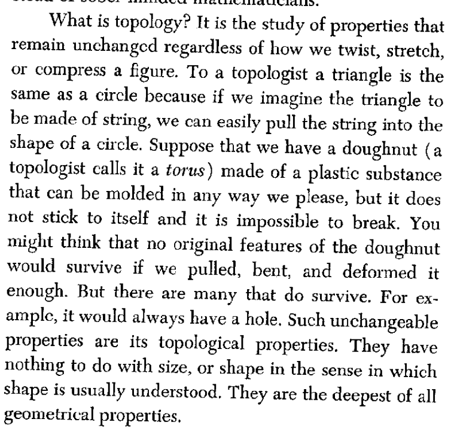
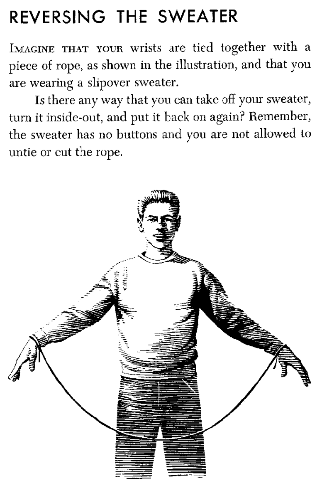
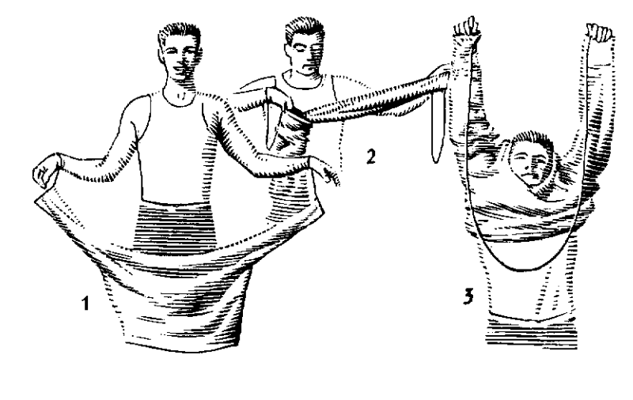
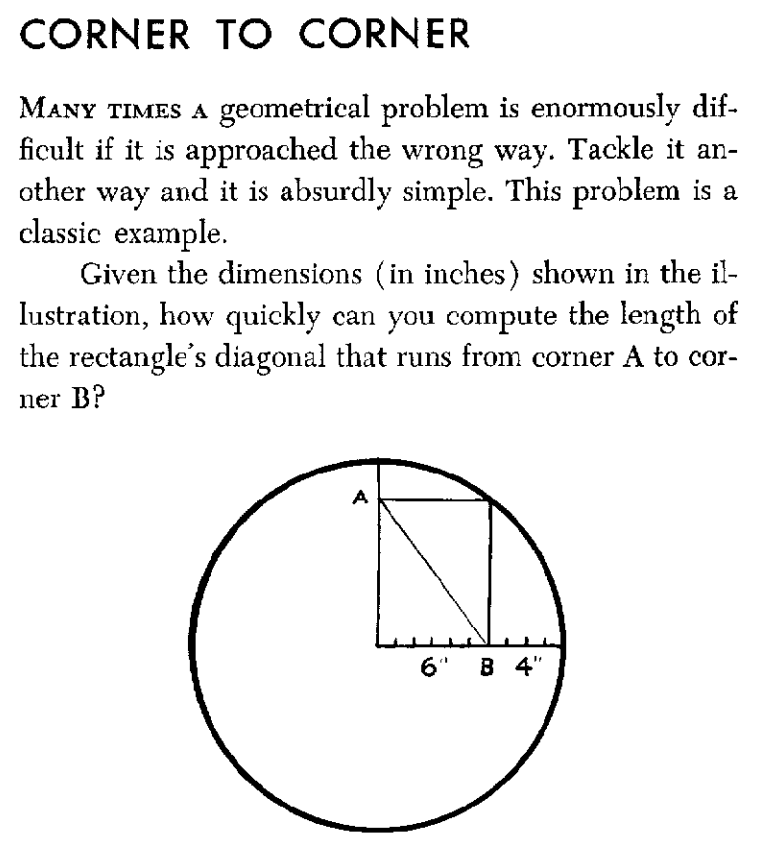
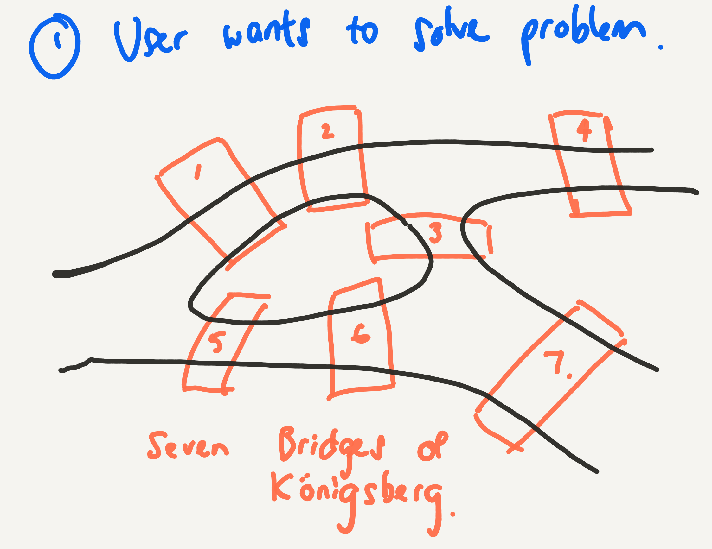
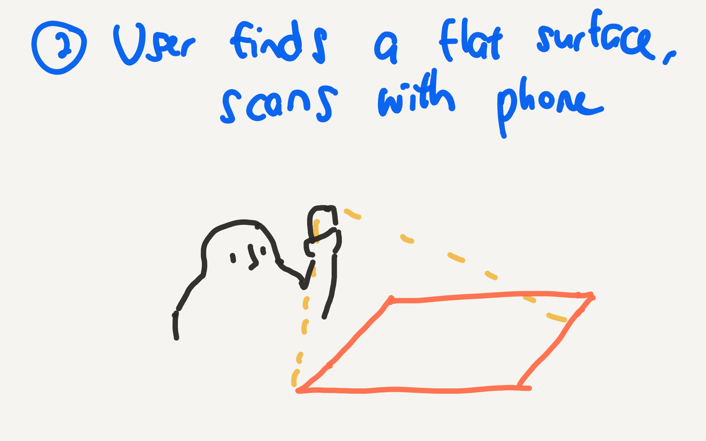
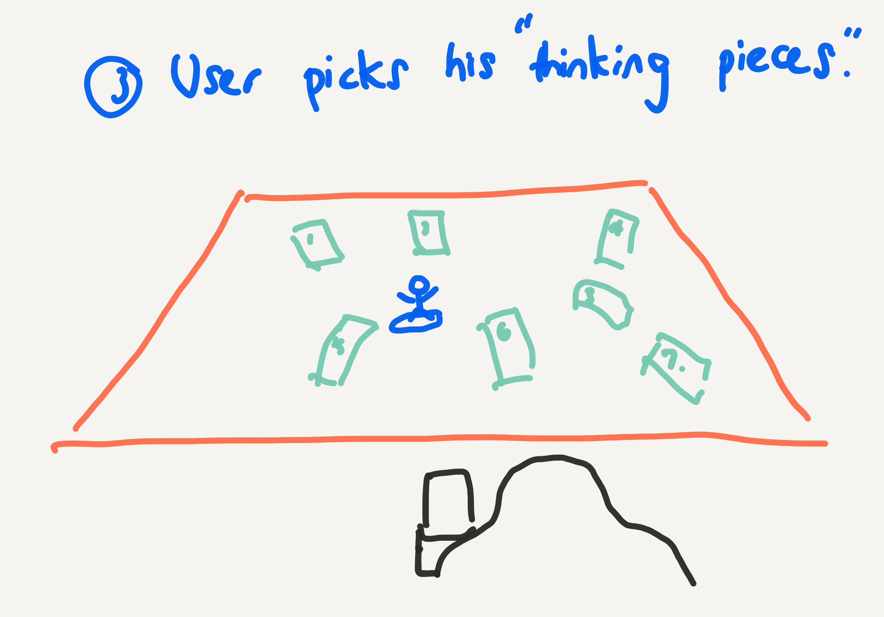
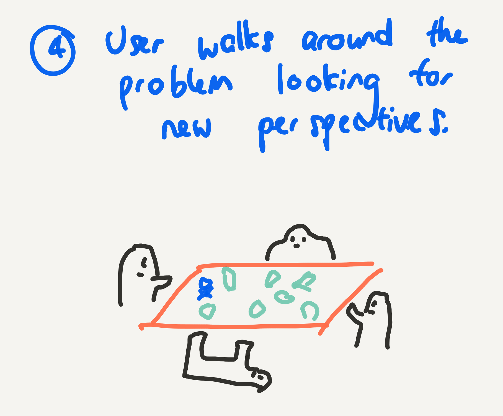

### 7 in 7: Day 3 - Accessible Puzzles ###

#### Guiding Questions ####
* How do puzzles allow people to discover patterns?
* Which puzzles do they find most accessible?

#### Inspiration: Serendipity ####
On Thursday's lecture, Lance Weiler, whom I mentioned in my presentation as an inspiration for my design values, explicitly mentioned designing for micro experiences and giving time and space for audiences to make serendipitous discoveries. In the immersive experiences that he shared, he provided  aesthetics such as props and set design, that clued the audiences in on the possible interactions available for each scene. The serendipity happens when the audience explores these aesthetics and comes across something unexpected.

#### Inspiration: Accessible Math through Aesthetics ####
I recall spending many a recess reading Martin Gardner's books on mathematical puzzles. While they weren't obviously mathematical at first glance, through the course of solving them, I discovered certain tips and tricks that were actually mathematical thinking at play. I must admit that I was never terribly good at solving puzzles, but somehow, because of the way Gardner presented these puzzles, they were easy to get my hands on, and I could just dive right in.

Gardner remarked in an [interview with the Guardian](https://www.theguardian.com/science/alexs-adventures-in-numberland/2014/oct/21/martin-gardner-mathematical-puzzles-birthday)  
> “A puzzle in a sense models what all scientists are doing ... they are trying to solve puzzles about the nature of the universe.” 

> Puzzles both provoke creative thinking and are a starting point for interesting research.

> “Puzzles can lead you into almost every branch of mathematics,” he added.

I thought this was very powerful and decided to dive deeper into some elements that are prevalent in his puzzles, and prototype the interactions.

##### Storytelling and Context #####
   
Gardner uses simple storytelling and conversations to show possible ways of approaching the problem. Context is provided that makes the problem a possibility in our every day lives, which also encourages us to be curious to look for interesting problems such as these.  

    
In the book "Entertaining Mathematical Puzzles", he provides eloquent descriptions of different areas of mathematics. He uses descriptive but simple prose, and frequently uses the words "imagine" and "suppose".

##### Replication and Embodiment #####
 
    
Gardner presents problems in ways that can be easily replicated by the reader. He understood that in order to make problems and solutions relatable, they must be exist outside the context of the pages of the book, and into the real world. By inviting the reader to try the problems out for themselves, be it through acting or iterations by pen and paper, the reader is able to better conceptualize the problems at hand, and deriving patterns on their own. 

##### Reframing #####
    
He has a number of lateral thinking puzzles. In the abovementioned book, he labels them as "tricky" puzzles, encouraging users to approach problems that they think they know the answers to, challenging assumptions and deriving deeper understanding.

#### The Idea ####
    
    
    
    
This prototype attempts to incorporate the above features: storytelling and context, replication and embodiment, and allowing for different solutions. This prototype is an AR problem solving tool that provides tokens and models to aid in illustrating a problem, which the user can code via visual programming, drag-and-drop interface.

Objects to think with are helpful for offloading from working memory, similar to sketching. But in this case, the affordance of AR and the ability to look at the problem from multiple perspectives is invaluable.

Whilst tokens (pennies, post-its, plasticine) can be used in place, AR can provide a more accurate symbol of the problem at hand. Recording features such as screenshots and voice recordings can help document the thinking process.

#### Reflections ####
This prototype could potentially be useful, especially in collaborative problem solving situations. Here, I am trying to elucidate the factors that help make a puzzle approachable, controllable, and the first step towards driving agency in problem solving. I believe the same insights gleaned from Martin Gardnet can be applied to many other solutions towards making the abstract more manageable and concrete.

