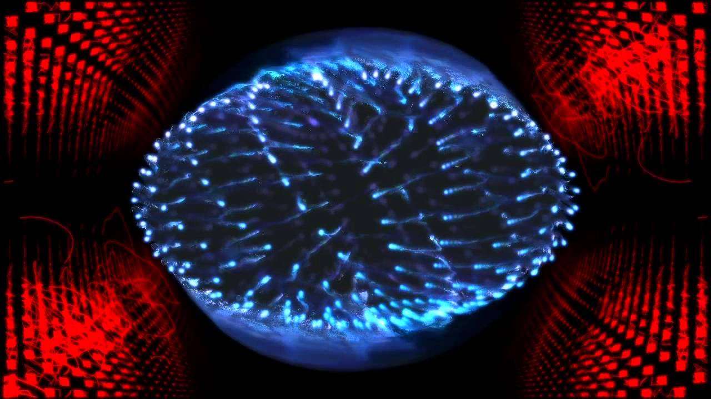
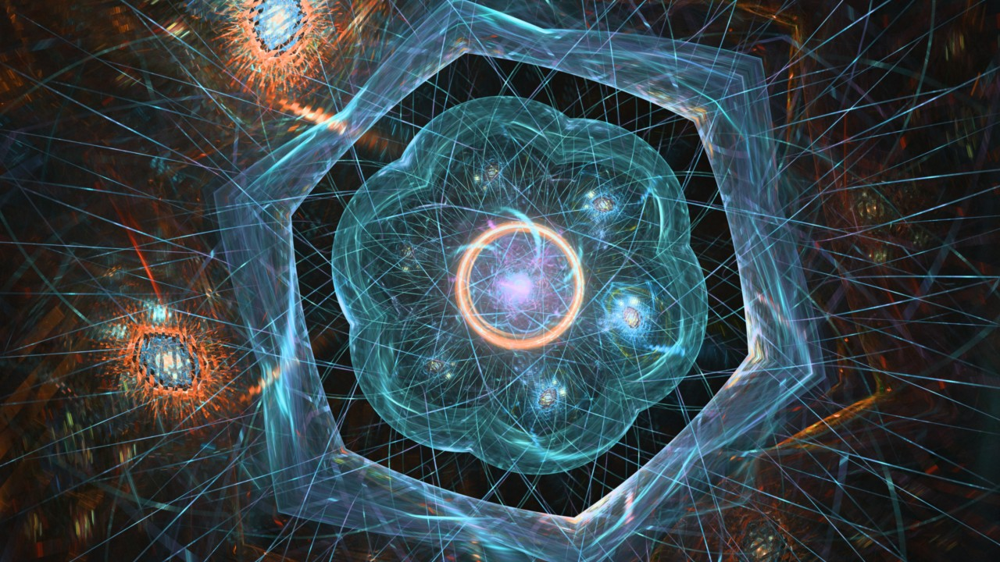

### 7 in 7: Day 5 - Notes and Patterns ###

#### Focus Today ####
* How do waveforms in music allow us to see patterns? 
* What information in visual and audio modes of music allow us to notice patterns better?

#### Inspiration ####

  
I have always been interested in music visualization, since my thesis project during my undergrad which visualized music and gestures resulting from music making. Many music visualization tools from the old days of WinAmp were generic ones that responded to levels (loudness, frequency spectrum). They were visually interesting in that they were dynamic and depending on how they were coded, produced beautiful patterns. Patterns like chord progressions or beat patterns could also be seen as the visualizations would appear periodically.

I am also inspired by visual and interactive explanations such as [this one by Josh Comeau](https://pudding.cool/2018/02/waveforms/).

#### The Idea ####
While aesthetically pleasing and transfixing to behold, the links between music and patterns in these cases are not always obvious. I am more curious as to how it can be aesthetically pleasing and yet be consistent with the nature of the music; the focus is more on linkages as opposed to creative expression.

For today's prototype, I aim to create more of a tool to express and explore these linkages.

#### Process ####
Using Processing, I created a sketch that produced waveforms of notes accurately (using their values in Hz), and synthesizing these notes using a sine oscillator. I used a simple mapping scheme using the colors of the rainbow to visualize one octave.

<iframe src="https://player.vimeo.com/video/369592460" width="640" height="564" frameborder="0" allow="autoplay; fullscreen" allowfullscreen></iframe>  

I wanted to visualize patterns like chords to understand why they sound harmonious.

<iframe src="https://player.vimeo.com/video/369592473" width="640" height="564" frameborder="0" allow="autoplay; fullscreen" allowfullscreen></iframe>

#### Reflections ####
Though wave analyses of music are nothing new, but such a tool allows me to use two senses to try to find patterns, through looking at similarities and differences. 

There was [an observation](http://www.musicmasterworks.com/WhereMathMeetsMusic.html) that "This is the secret for creating pleasing sounding note combinations: Frequencies that match up at regular intervals", and such a visual/audio tool allows me to verify such an observation. I am curious as to academic research that verifies or debunks this theory more rigorously.

The downside is that this only works for notes held down, and not useful for sequences of notes.
