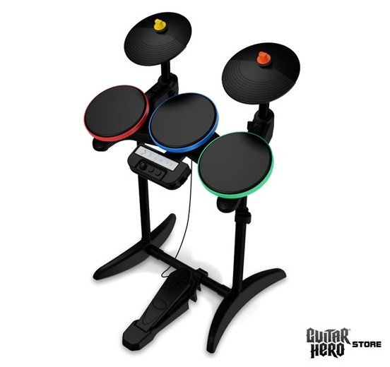
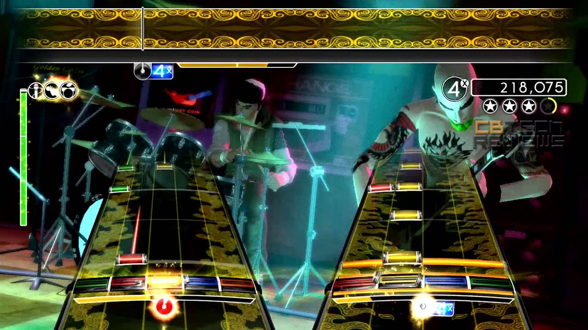
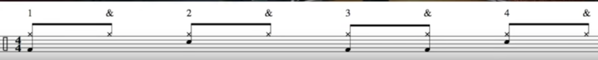
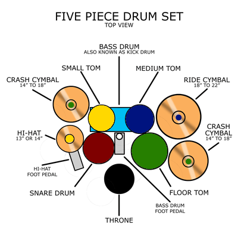

### 7 in 7: Day 6 - Beat Patterns ###

#### Guiding Questions ####
* How can one recognize and remember beat patterns on the drum set?
* How can beat patterns be visualized in meaningful ways? 

#### Inspiration ####

I first got really interested in rock and roll when I played Guitar Hero series of games with physical controllers. This was somewhat an opportunity to get a feel for different instruments using their game controllers. The game controller that most resembled its instrument counterpart had to be the drums, and I recall getting used to the patterns in the song. However, this memory was only triggered in the context of the game, largely due to the nature of the game mechanic of falling pellets.  
       

#### The Idea ####
 This prototype is primarily to better understand the types of feedback that would help a player understand, learn and remember drumming patterns. I am curious as to how to recognize beat patterns in drums can be recognized through multiple modes. I initially conceived of this as an embodied experience, projected onto a wall and possibly allowing the player's sticks to be detected via computer vision or other wireless tracking methods. Ideally, the visual instructions should mirror sheet music, such that it is transferrable.  
   

#### Process ####
I created a sketch in Processing that included some features I would like to test out. These include:
* a visual and audio metronome, similar to the Guitar Hero mechanic but recontextualized to drum sheet music;
* drumset layout mirroring what the drummer would see;
* parts of the drums that would light up based on the pattern that the player would like to learn (not implemented).  

<iframe width="560" height="315" src="https://www.youtube.com/embed/n_vIGATMc0Q" frameborder="0" allow="accelerometer; autoplay; encrypted-media; gyroscope; picture-in-picture" allowfullscreen></iframe>  

<iframe width="560" height="315" src="https://www.youtube.com/embed/ZXt6AQ0dqTM" frameborder="0" allow="accelerometer; autoplay; encrypted-media; gyroscope; picture-in-picture" allowfullscreen></iframe>

#### Reflections ####
  
This was an excellent learning experience in terms of understanding the different parts of the drum set and the sounds they make, as well as the drum sheet music notation and how it corresponds to the tone of each of the drums. As this prototype still only has keyboards as its controls, it would be interesting to rig this up to a digital drum set to see how well it helps me learn drum patterns. I think this experience encompasses a lot of modes that I would like to have: embodied actions, visual indicators and of course, audio feedback.

