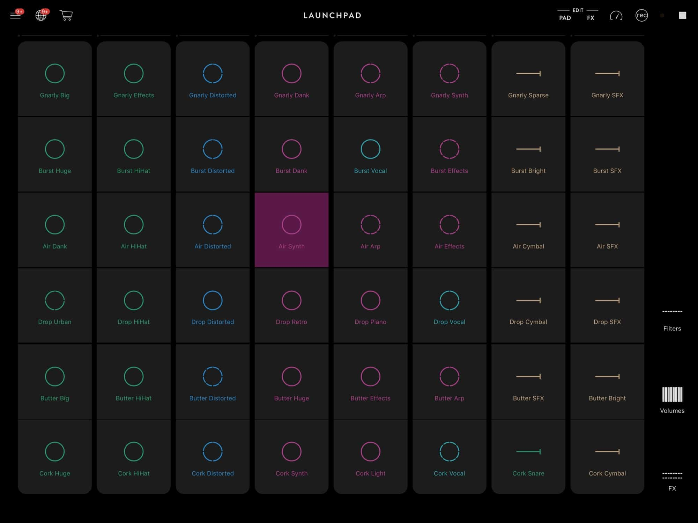

### 7 in 7: Day 7 - Tactile Musical Space ###

#### Guiding Questions ####
* How can I express patterns or facilitate discovery of patterns inherent in EDM music?
* How might tangible music feel like?

#### Inspiration ####
During my younger and wilder days, I used to frequent clubs. One of the most powerful experiences was dancing beside the main speakers and feeling the full force of the throbbing. While it was deafening, it was when I distinctively felt the vibrations coursing through my body. Being one with the music became very instinctive.  

    

I have also been very fascinated by EDM and how easy it is to pick up and explore using iPad apps such as Novation Launchpad. The clips are automatically synced to the beat, and the layout is clearly labelled according to EDM's structures.

#### The Idea ####
What if all sound objects, like the bass or kicks, could be picked up and moved, allowing for users to remix their experiences mainly by how it feels in their hands? What if they could grab these objects and place them in space, that allowed for a 3D spatial sound experience for listeners and feel-ers? What if they could be attached to different parts of the body, enabling different sensations based on where they are placed? 

This prototype would consist of sound objects with unique shapes that allow for tweaking of parameters like tempo on the object itself, or perhaps placed at different levels (height, distance away from a source etc). The DJ would move these objects so they are curated spatially. The audience would move through the space and experience the music, or may place these components themselves on their bodies.

    
     
       

#### Reflections ####
The vibrations from a speaker is relatively indistinguishable, other than distinctive beats. Perhaps other modes may convey melodies or other subtler percussive elements more succinctly.

