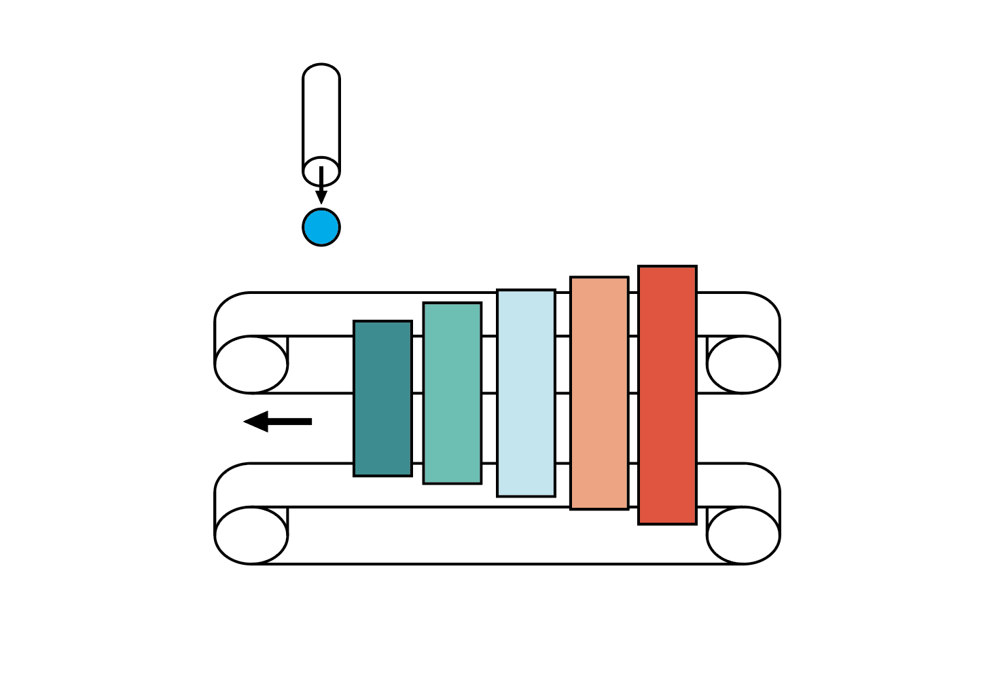
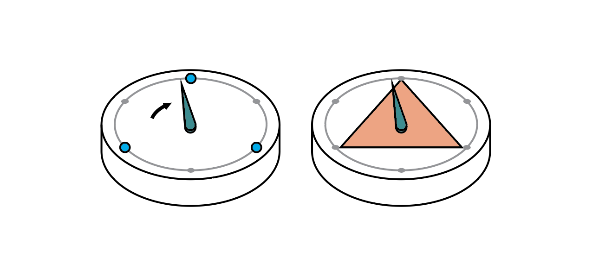
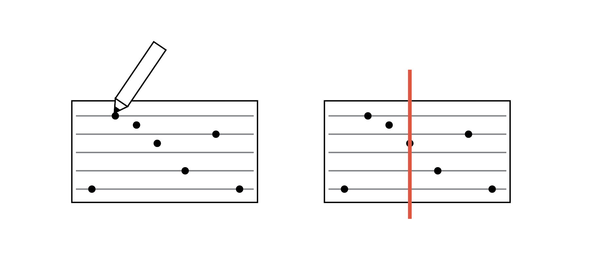
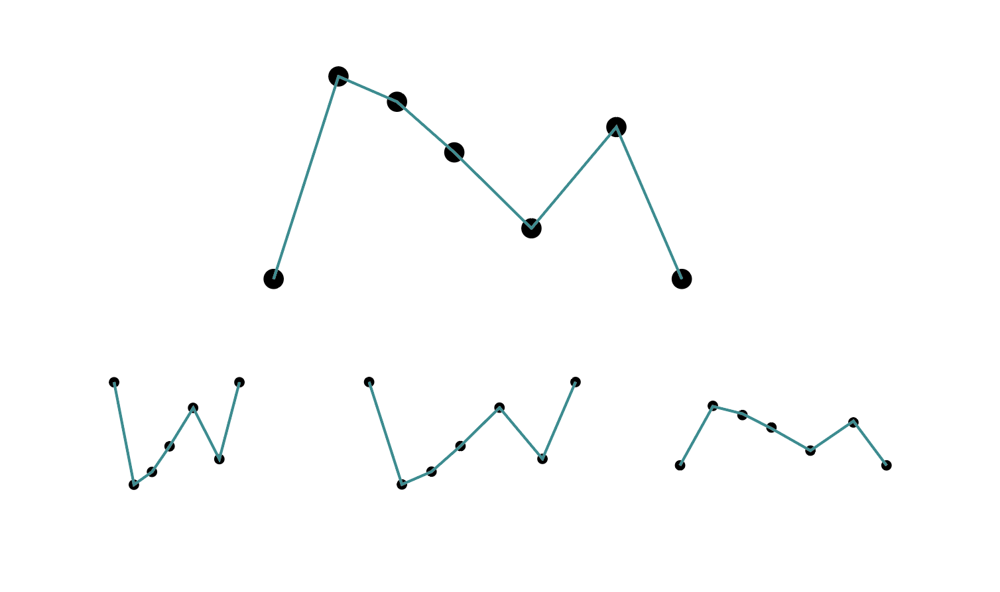
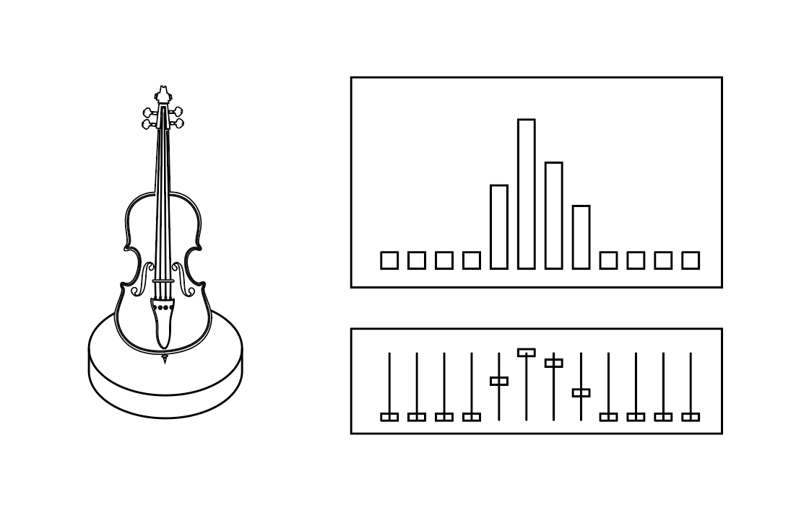

### Functional Prototype ###

#### Reflections from 7-in-7 ####
From my 7-in-7 exercises, through making and experimenting, I was trying to understand:
* how math can be more accessible through analogies, such as simplified models
* how math manifests itself to us, through our senses like sight, sound and touch
* how music manifests itself to us, through our senses like sight, sound and touch
* aspects of math in music, such as vibrations, frequencies, waveforms
* aesthetic qualities inherent in both math and music
* how collaborative creation spaces might look like for music

Upon reflection, I encountered a few challenges:
* math is by definition abstract: manifestations of math in music (other than visualizations like diagrams or graphs and charts) invariably involve physics. It is no wonder that many philosophers wax lyrical about math being the language of the cosmos.
* music is inherently auditory: manifestations of music in other forms are invariably translations of musical expressions and is questionable as to how musical it can be, without resorting to metaphors
* many aspects of math and music theory can be very advanced in terms of math required: FFT, Gabor Transforms and harmonics can require a lot of prerequisite knowledge, and beyond the scaffolds that my target audiences possess

Key questions:
* How can we minimize the focus on physics, since that can be easily done and more accurately modelled with physics experiments? How can we focus on aspects of math?
* How can we tap on the auditory aspects of music and minimize translations?
* How can we explore interesting aspects of math in music without going too deep into prerequisite academic knowledge?

#### Functional Prototype ####
For my functional prototypes, I've decided to explore multiple aspects of music, tentatively titled "Musical Math: A Hands-On Playspace". Targeted at pre-teens and teens, and situated in a museum, it consists of five interactive stations:
* Sound as Vibration: the first station, and establishing that sound is a wave, and changing the frequency of the wave changes how it sounds. To demonstrate this, a large, interactive Rubens' Tube (flame tube) or standing wave tube is situated prominently at the entrance. The frequency can be changed via a tone generator, which participants can control (knobs, sliders etc).  

* Ratios in Frequencies: in diatonic scales, notes have fixed frequencies, which commensurate with the vibrating medium. As the goal is for hands-on exploration, the difference in the vibrating medium needs to be obvious. This can be achieved via wooden plates that are sized proportionately, such that when a marble hits it, it makes the corresponding note. They can be colored accordingly, and is analogous to Cuisenaire rods used in Montessori to indicate scale and proportionality.  
  

* Ratios in Rhythms: musical rhythms are the ratio of sounds to silence over time. rhythms are commonly denoted in sheet music, and are hard to elucidate without knowing musical notation. Inspired by Xronomorph, a software designed by Andrew Milne, as well as the TED animation of Varney's Wheel, the circular represetation of beats is immensely useful for a musical theory novice like myself to understand. This machine uses marbles/pegs which, when hit by the rotating needle, triggers a sound.  
   

* Fractals/Symmetries in music: some composers use repeating patterns of melodies to interesting effect. Fractals symmetries, and transforms are harmonious to the ear, but may be hard to identify in sheet music. By getting participants to create their own sequence of notes (melodies), reading it into a computer program and playing up various transformations, they can experiment for themselves the most satisfying compositions, and develop a better awareness for patterns.  
   

* Mixing Waves: sound waves, like all waves, can be added and subtracted, producing resultant waveforms. With the goal of reproducing the distinctive sound of an instrument like a violin, and using a spectrum analyzer, participants are encouraged to experiment with adding sounds and hearing the results.  
  