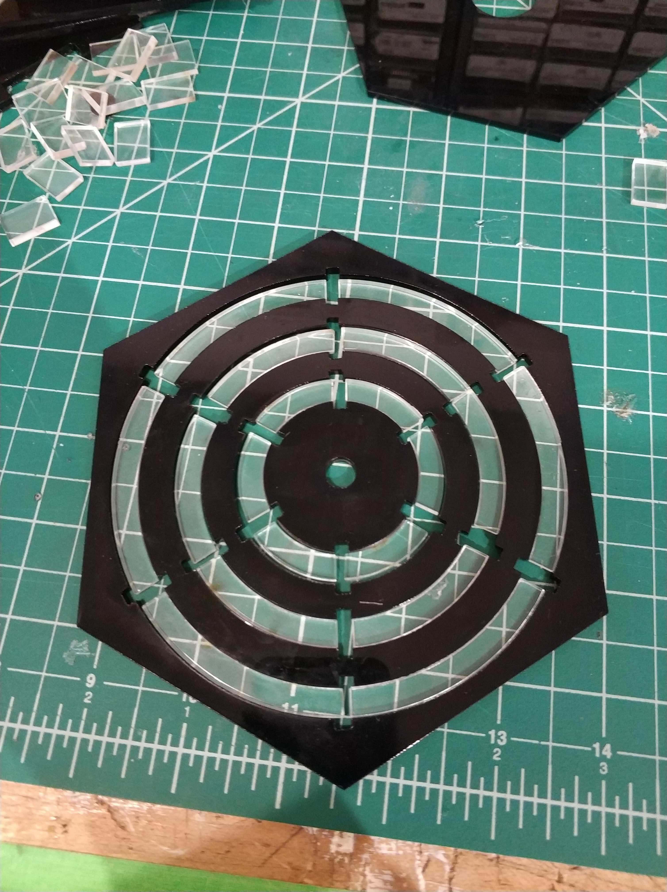

### Aesthetic Prototype ###

My slides on Aesthetic Prototype are [here](https://docs.google.com/presentation/d/1nQwSmDxvm0Lf8SRkZtxGwoW-2WrtzkRWx0wgWbjpaJQ/edit#slide=id.g6b21f92ed5_0_127).

#### Colors ####
Looking at all my precedents on visualizations of wave motion (standing wave generators), vibration (Chladni Plates), osciloscopes, I noticed that they tend to have a glow to them, largely due to technology used, or for better contrast. I am inspired to use this contrast along with brighter neon colors, or UV blacklight. I am also inspired by immersive spaces which create a unique, otherworldly feel which frees the participant to experiment and expplore. Examples of this include the Avatar ride in Disney World, and Tron set design.

#### Shapes ####
Similar to the sketches in my Functional Prototypes, I strive for a simple aesthetic that instead focuses on the subject matter at hand. Simple but aesthetically relevant shapes like circles for the circular notation based beat machine; rectangular but proportionate pieces of wood for the marble dropping music maker.

#### Beat Machine ####
I decided to create an aesthetic prototype for my beat machine. Using lasercut acrylic and colors, shapes outlined above, I wired up LEDs and a motor to create the prototype.  

  

Being a prototype, and deciding that making it functional was too complex at this point, I made a Wizard of Oz demonstration. In this gif, I was pressing buttons to light up the rings as the needle passed the inserts.  
  

It was more challenging than I thought. Gluing the whole piece together was a nightmare (hexagonal box, clear plastic arcs), and so was soldering the LEDs. The motor was difficult to set up and extending the axle required some work. A greater concern was the UI: the small acrylic pieces are confusing (what should I do with them?), and so were the slots they were supposed to fit into. The final prototype has to address this issue. For ease of construction and time constraints, I may consider using a more software-oriented approach.
