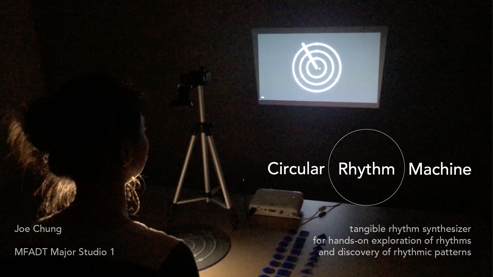
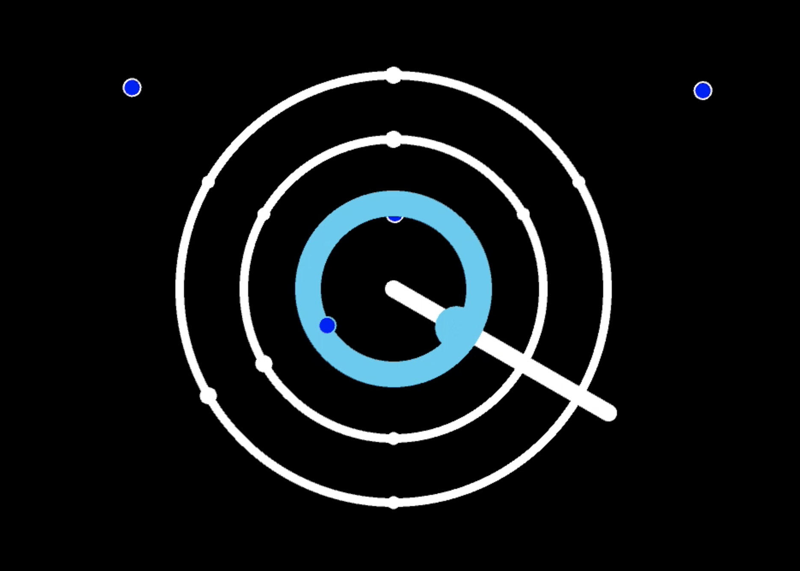
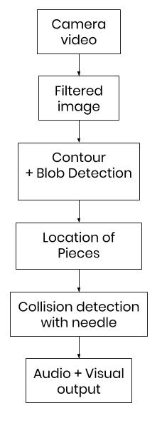

### Final Project ###

  

Project video on Vimeo [here](https://vimeo.com/380160857)  

Final presentation slides [here](https://docs.google.com/presentation/d/1PNI4ZjDDeda9D9DIZU5LmzRpgUPjoUkIRtL1YzzvPf4/edit?usp=sharing)  

#### Abstract ####
Music captivates audiences through making and breaking auditory patterns, while mathematics reveals those patterns. Circular Rhythm Machine is a tangible rhythm synthesizer that is designed as an interactive museum installation, focusing on rhythm creation through hands-on placement of sound tokens on a play area. Akin to the moving hands of a clock, the needle sweeps through the play area, detects the sound tokens, and produces one of three drum sounds, depending on location within the play area. The participant, through hands-on play and experimentation, is able to create and edit rhythms in real-time. Designed for pre-teens, the goal is to encourage pattern deconstruction, prediction and creation using rhythms in a spatial, circular format.  
   
Play mat and sound tokens  

  
Screen with innermost ring triggered  

#### Implementation ####
Circular Rhythm Machine consists of three parts: the play area, consisting of the play mat, tokens and an external webcam; the processing machine, in this case a Macbook Pro running Processing; and the connected visual audio devices, including a projector and speakers. The webcam can be mounted against the wall or from the ceiling.  

  
Circular Rhythm Machine’s typical setup, with video capture device, play mat, tokens and processing machine.  

During set up, the setup mode is displayed, which allows several perimeters to be adjusted based on the lighting conditions. This includes adjusting for contrast between tokens and the play mat, thresholding for blob size and pixel values.  

  
Processing flow  

During play mode, the user places tokens on the play mat, the webcam captures the video feed of the play area. Filtering is done using the OpenCV Processing library, followed by contour detection, blob detection, which eventually gives the screen coordinates of all the tokens in the capture area (represented on the screen as a blue circle). Once the needle intersects any of the tracked points, the corresponding sound clip is played. Each of the rings produce a different sound, allowing for exploration of rhythms in one sound alone, or as a composition of sounds. The tokens can be placed anywhere, and sounds will be triggered anywhere along the circumference of the rings, though the printed markings serve as scaffolds for the beginner.